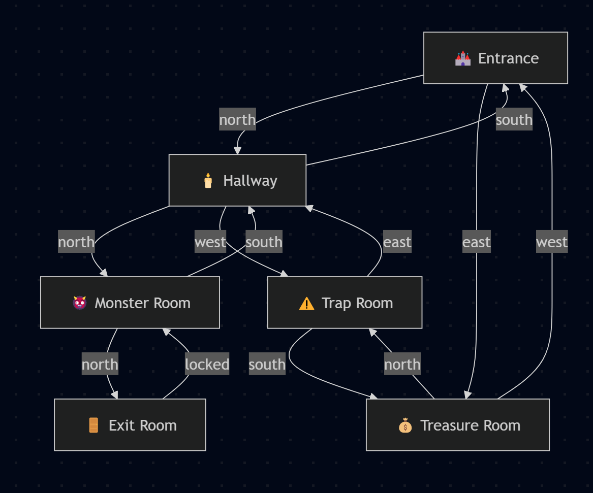

**Dungeon Adventure** text-based game:

---

# 🏰 Dungeon Adventure

A classic, text-based dungeon exploration game written in Node.js. Enter a mysterious dungeon, collect treasures, avoid deadly traps, and escape with your life — if you can!

---

## 🎮 Features

- Explore interconnected rooms in a dark dungeon
- Collect items and treasure
- Fight monsters (or run away!)
- Avoid hidden traps
- Find the golden key and escape the dungeon
- Tracks visited rooms, collected items, and your survival rate

---

## 📦 Requirements

- [Node.js](https://nodejs.org/) v14+ installed on your machine

---

## 🚀 How to Play

1. **Clone or Download** this repository.

2. **Navigate to the folder**:

   ```bash
   cd dungeon-adventure
   ```

3. **Run the game**:

   ```bash
   node dungeon-adventure.js
   ```

4. **Enter your name** and begin exploring.

---

## 🕹️ Commands

Type these in the terminal during gameplay:

| Command            | Description                            |
|--------------------|----------------------------------------|
| `go north`         | Move north (also works: `north`)       |
| `go east`          | Move east                              |
| `take gold key`    | Pick up an item in the room            |
| `inventory` or `i` | View your inventory and health         |
| `look`             | Re-describe the current room           |
| `help`             | Show command list                      |
| `quit` or `exit`   | Quit the game                          |

---

## 🗺️ Dungeon Map (Mermaid)



---

## 📌 Notes

- If your health drops to 0, the game ends.
- You need the `gold key` to unlock the exit door.
- Drinking a health potion will restore up to 50 HP (max 100).

---

## ✅ To-Do / Ideas

- Add saving/loading game state
- Add more rooms and puzzles
- Web or GUI version
- Multiplayer support?

---

## 🧙 Author

Made with ❤️ by MrCodeBS
